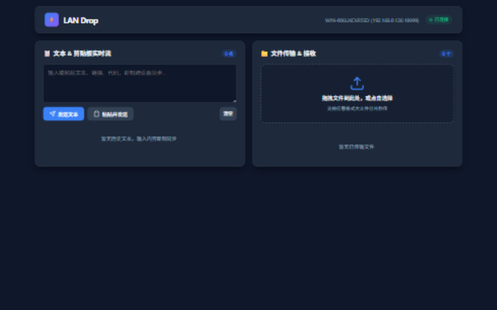
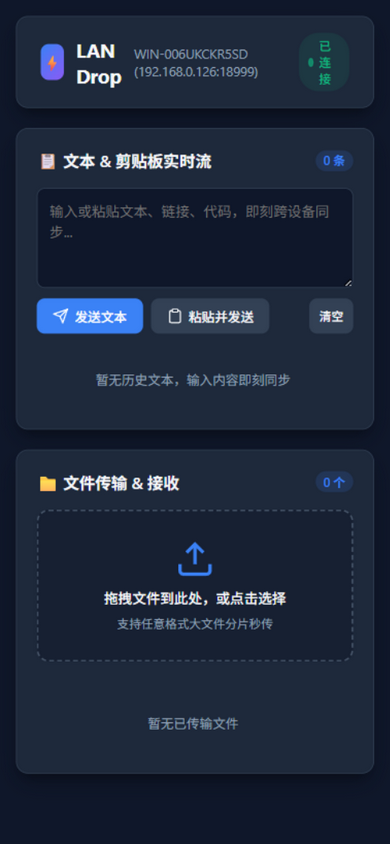

# ⚡ LAN Drop

**局域网极简跨设备传输站** —— 一个单文件、零依赖的跨平台工具，让手机、平板与电脑在同一 Wi-Fi 下互传文件、同步剪贴板文本，无需数据线、无需登录任何账号、不经任何第三方云端。

**English documentation: [README.en.md](README.en.md)**

[](https://github.com/GodBook/lan-drop/releases)
[](https://github.com/GodBook/lan-drop/actions)
[](https://go.dev)
[](https://github.com/GodBook/lan-drop/releases)
[](go.mod)



---

## ✨ 核心特性

| 特性 | 说明 |
| :--- | :--- |
| 📦 **单文件零依赖** | 所有 Web 资源在编译期通过 `//go:embed` 内嵌进二进制，目标机器无需安装任何运行时，下载即用 |
| 📱 **扫码直连** | 启动后在终端渲染二维码（多网卡时逐个输出），手机系统相机 / 微信扫码即达 |
| 🧠 **智能网卡探测** | 自动过滤 Docker / VMware / WSL / Hyper-V / VPN 等虚拟网卡，优先返回真实物理局域网 IP |
| 🔒 **会话级安全** | 动态 4 位 PIN + 常数时间比较 + 连续失败锁定（防穷举）；登录签发随机 256 位会话令牌，PIN 明文永不出现在 Cookie；WebSocket 校验 Origin 防 CSWSH |
| 🚀 **并发分片上传** | 前端按 4MB 分块、3 路并发流式上传，服务端临时分块落盘 + 原子合并，任意大小文件常驻内存仅 15~30MB |
| ⏸ **断点续传** | 上传中断后重新选择同一文件，已传分片自动跳过（`/api/upload/status` + 客户端指纹记忆），刷新页面也不丢进度 |
| 📶 **断点续传下载** | 下载端完整支持 HTTP `Range` 请求，支持多线程加速与意外中断恢复 |
| 💬 **实时文本广播** | 基于 RFC-6455 自研 WebSocket（含心跳保活与超大帧防护），任何设备发送文本即刻全网推送，新设备自动同步最近 50 条历史 |
| 💾 **历史落盘** | 文本流持久化到磁盘，重启服务不丢历史 |
| 🖼 **剪贴板图片直传** | PC 端直接 Ctrl+V 粘贴截图，自动作为图片文件传输到手机 |
| 👀 **媒体在线预览** | 图片 / 视频 / 音频点击即可在页面内预览（RFC 5987 编码保证中文名下载不乱码） |
| 🔔 **桌面通知** | 页面在后台时，收到新文件 / 新文本弹出系统通知 |
| 🧹 **自动清理** | 中断上传的临时分块目录按 TTL 自动清扫；合并失败自动回滚不留半截文件 |
| 🧩 **纯标准库** | 后端 100% Go 标准库（零第三方包），供应链安全，`go build` 一把梭 |

## 🚀 快速开始

### 方式一：直接下载（推荐普通用户）

前往 [**Releases**](https://github.com/GodBook/lan-drop/releases) 页面，下载对应平台的可执行文件：

| 平台 | 文件 |
| :--- | :--- |
| Windows x64 | `landrop-windows-amd64.exe` |
| macOS Apple Silicon (M1/M2/M3/M4) | `landrop-darwin-arm64` |
| macOS Intel | `landrop-darwin-amd64` |
| Linux x64 / arm64 (树莓派) | `landrop-linux-amd64` / `landrop-linux-arm64` |

Windows 用户双击 exe（或仓库自带的 `start.bat`）；macOS / Linux 用户在终端运行：

```bash
chmod +x landrop-darwin-arm64   # 仅首次需要
./landrop-darwin-arm64
```

> macOS 首次运行若提示"无法验证开发者"，请执行 `xattr -d com.apple.quarantine landrop-darwin-arm64` 后重试。

### 方式二：Docker

```bash
docker run -d --name landrop \
  -p 8087:8087 \
  -v landrop-data:/data \
  ghcr.io/godbook/lan-drop:latest
```

镜像基于 Alpine、以非 root 用户运行，接收文件落在卷 `landrop-data`。也可以用 `docker build -t landrop .` 自行构建。

### 方式三：从源码编译

```bash
git clone https://github.com/GodBook/lan-drop.git
cd lan-drop
go build -ldflags="-s -w" -o landrop .
./landrop
```

要求 Go 1.22 及以上，无任何第三方依赖需要拉取。

## 📖 使用说明

### 启动

```bash
# 1. 默认启动（端口 8087，文件存至 ~/Downloads/LAN_Drop，随机 PIN，自动打开浏览器）
./landrop

# 2. 自定义端口与存储目录
./landrop -p 9090 -d /data/shared_files

# 3. 固定 PIN 码 / 关闭 PIN（仅建议受信任的家庭内网）
./landrop -pin 6688
./landrop -no-pin

# 4. 查看版本
./landrop -v
```

启动后终端会输出访问地址、PIN 码与二维码，PC 浏览器自动打开本机页面：

```
==================================================================
   ⚡ LAN Drop v1.1.0 - 局域网极简跨设备文件与文本极速快传站
==================================================================
 🌐 局域网访问地址 : http://192.168.1.5:8087/?pin=8579
 🔒 访问 PIN 码    : 8579 (扫码可直接免密进入)
 📂 文件存储目录   : /Users/you/Downloads/LAN_Drop
------------------------------------------------------------------
 📱 手机扫码直达 (用微信/系统相机扫描下方二维码)：
 ██████████████████
 ...
==================================================================
```

### 命令行参数

| 参数 | 默认值 | 说明 |
| :--- | :--- | :--- |
| `-p` | `8087` | 服务端口（被占用时自动递增寻找可用端口） |
| `-d` | `~/Downloads/LAN_Drop` | 接收文件的存储目录 |
| `-pin` | 随机 4 位 | 固定访问 PIN 码 |
| `-no-pin` | 关闭 | 关闭 PIN 身份验证 |
| `-no-browser` | 关闭 | 启动时不自动打开浏览器 |
| `-v` | — | 打印版本号并退出 |

### 传输流程

1. 电脑启动 `landrop`，终端出现二维码（多网卡时每个网卡各一个）；
2. 手机连接**同一 Wi-Fi**，扫码打开网页（扫码自动免 PIN，Cookie 为随机会话令牌）；
3. 手机选相册文件 / 拖入任意文件 / PC 直接 Ctrl+V 粘贴截图 → 分片并发上传；
4. 任意设备在文本框输入内容 → 所有在线设备实时同步，一键复制；
5. 页面切到后台时，新文件 / 新文本自动弹系统通知。



## 🔌 API 一览

前端页面之外，服务端同时暴露完整的 REST / WebSocket 接口，可被脚本或第三方客户端调用。鉴权方式（三选一）：`?pin=` 查询参数、`X-PIN` 请求头、或 `/api/auth` 成功后下发的 `landrop_session` Cookie。

| 路径 | 方法 | 说明 |
| :--- | :--- | :--- |
| `/api/info` | GET | 获取主机名、IP、端口与存储目录 |
| `/api/auth` | POST | 提交 `{"pin":"1234"}` 完成鉴权并下发会话 Cookie（连续失败 5 次锁定 30 秒） |
| `/api/upload/chunk` | POST | 上传单个 4MB 分片（Multipart: `file_id` / `chunk_index` / `total_chunks` / `filename` / `chunk`） |
| `/api/upload/status` | GET | 查询 `file_id` 已到货的分片列表（断点续传核心） |
| `/api/upload/complete` | POST | 触发分片原子合并落盘（缺片拒绝且不留半截文件） |
| `/api/files` | GET | 获取已接收文件列表 |
| `/api/files/delete` | POST | 删除服务端指定文件 |
| `/api/download/{filename}` | GET | 下载文件（支持 `Range` 断点续传；`?inline=1` 切换为内联预览） |
| `/api/ws` | GET (WS) | WebSocket 长连接（文本实时广播通道，校验 Origin） |
| `/api/text/send` | POST | 发送文本广播（WebSocket 的 HTTP 降级方案，上限 1MB） |
| `/api/text/feed` | GET | 获取最近 50 条历史文本 |

## 🏗️ 项目结构

```
lan-drop/
├── main.go                      # 进程入口：CLI 参数、多网卡二维码、自动开浏览器、优雅停机、临时目录清扫
├── go.mod                       # 模块定义（零第三方依赖）
├── Dockerfile                   # 多阶段容器构建（Alpine + 非 root）
├── Makefile                     # 多平台交叉编译一键脚本 (make build-all)
├── start.bat                    # Windows 双击启动脚本
├── internal/
│   ├── console/                 # Windows 终端 ANSI/VT 支持
│   ├── network/ip.go            # 局域网物理网卡智能过滤、可用端口自动探测
│   ├── qrcode/qrcode.go         # 纯 Go 实现的终端二维码编码与渲染引擎
│   └── server/
│       ├── config.go            # 配置、会话令牌、PIN 常数时间比较、限速、文本环形缓冲与落盘
│       ├── handler.go           # HTTP 路由、鉴权中间件、静态资源 ETag 缓存
│       ├── upload.go            # 分片接收、续传状态、原子合并回滚、Range 下载、TTL 清扫
│       ├── ws.go                # RFC-6455 WebSocket：帧校验、心跳、Origin 检查、优雅停机
│       └── *_test.go            # 单元测试 + httptest 集成测试
└── web/
    ├── index.html               # 响应式页面（移动端触控 / 桌面全屏拖拽 / PIN 弹窗 / 预览弹窗）
    ├── app.js                   # 并发分片上传、断点续传、粘贴图片、WebSocket 通信、通知
    └── style.css                # 深色主题、进度条、Toast 与预览组件
```

## 🛠️ 构建与发布

```bash
# 本平台编译
go build -ldflags="-s -w -X main.AppVersion=1.1.0" -o landrop .

# Makefile 一键全平台（版本号自动注入）
make build-all
```

仓库内置 **GitHub Actions** 流水线（`.github/workflows/build.yml`）：

1. 每次推送先跑 **gofmt 检查 + go vet + go test -race**；
2. 通过后编译全平台二进制并上传 Artifacts；
3. 推送 `v*` 标签自动创建 GitHub Release 附带全部二进制，并构建 **linux/amd64 + linux/arm64** Docker 镜像发布到 GHCR。

## ❓ 常见问题

**手机扫码后页面打不开？**
- 确认手机与电脑连接同一 Wi-Fi；
- 路由器若开启"AP 隔离（Client Isolation）"，局域网设备互相不可达，需在路由器后台关闭；
- 首次运行时 Windows 防火墙弹窗请勾选"允许"，否则会拦截入站连接；
- 多网卡环境下，终端会为每个候选网卡各输出一个二维码，扫对应的那个即可。

**大文件传输会吃满内存吗？**
不会。上传按 4MB 分片独立落盘，合并使用 `io.Copy` 流式管道，常驻内存约 15~30MB。

**上传到一半断了要重传吗？**
不用。重新选择同一个文件（文件名、大小、修改时间一致）会自动复用会话，已传分片跳过，只补缺失部分。

**网页端点"复制"没反应？**
部分浏览器（如非 HTTPS 的旧版 Safari）限制 `navigator.clipboard`，前端已实现 `document.execCommand('copy')` 降级兜底。

## 🗺️ Roadmap

- [ ] mDNS / Bonjour 服务发现，支持 `http://landrop.local` 免 IP 访问
- [ ] 一键自签名 TLS，提升开放 Wi-Fi 下的通信私密性
- [ ] 前端拖入整个文件夹，服务端自动归档为 Zip

## 📄 License

本项目基于 [MIT License](LICENSE) 开源。
